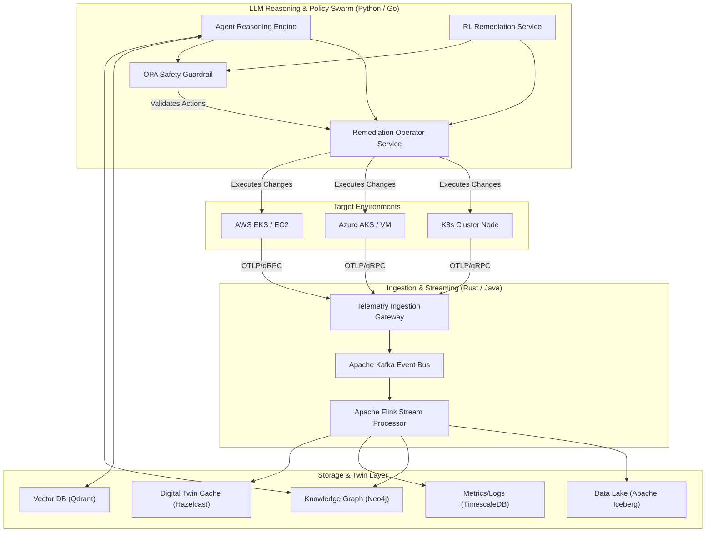
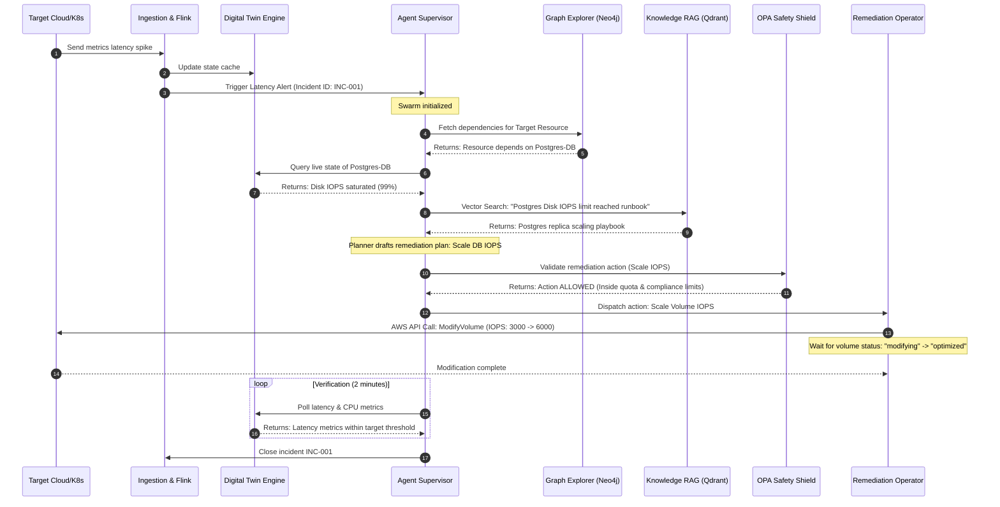
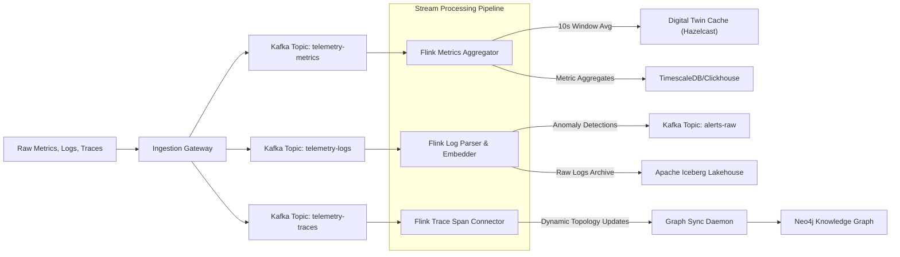

# ATHENA System Architecture & UML Diagrams

This document contains Mermaid diagrams visualizing the architecture, component relationships, sequence flows, and event-driven data streaming pipelines within the ATHENA platform.

---

## 1. System Component Architecture Diagram

The component diagram illustrates the relationships between ingestion, caching, persistence, reasoning, and cloud API orchestration.

---

## 2. Sequence Diagram: Incident Detection, Graph RCA, and Self-Healing

This sequence diagram illustrates the lifecycle of a latency incident from detection to autonomous recovery.

---

## 3. Event-Driven Data Flow Diagram

This data flow diagram details how raw telemetry from target systems is routed, aggregated, and written to analytical, graph, vector, and real-time stores.

